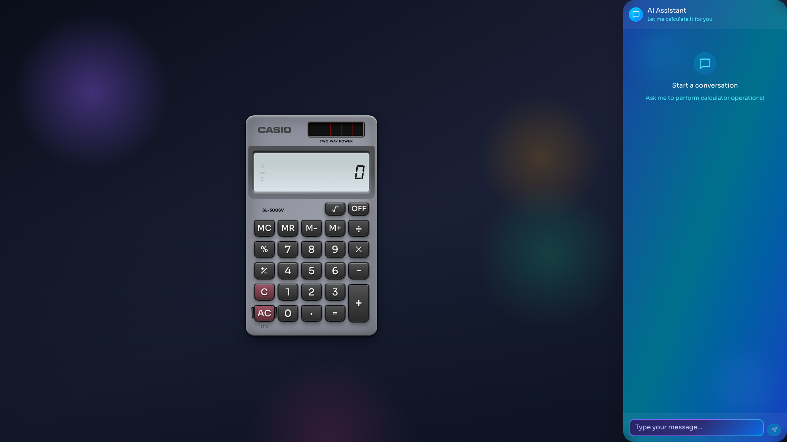

# MCPlator - Retro Calculator with AI Co-Pilot

A fully functional retro Casio-style calculator with an LLM-powered AI assistant. Features a polished retro UI with authentic animations and natural language calculator control.



## Features

- **Authentic Casio calculator** with complete functionality (memory, percentage, square root, sign change, etc.)
- **Polished retro UI** built with CSS Modules featuring authentic 3D button effects and LCD display
- **LLM-powered AI chat** that:
  - Understands natural language ("add 2 plus one hundred", "what's 15% of 80", "square root of 144")
  - Translates requests into calculator key sequences
  - Animates key presses on the calculator display in real-time
- **Persistent state** stored in IndexedDB (calculator memory, chat history, daily quota)

## Project Stats

**Total SLOC:** 11,181 lines (non-empty, excluding dependencies)

| Extension         | Lines |
| ----------------- | ----- |
| Markdown (.md)    | 3,935 |
| TypeScript (.ts)  | 2,509 |
| CSS (.css)        | 2,077 |
| TSX (.tsx)        | 1,952 |
| JavaScript (.js)  | 341   |
| JSON (.json)      | 224   |
| JavaScript (.mjs) | 98    |
| HTML (.html)      | 45    |

## Tech Stack

### Frontend

- **Framework:** React 19 + TypeScript 5.9
- **Build:** Vite 7.3
- **State management:** Zustand + IndexedDB (manual persistence)
- **Styling:** CSS Modules + Tailwind CSS 4.1 (hybrid approach)
- **Storage:** IndexedDB (via `idb` library)
- **Streaming:** Native `fetch` API for SSE

### Backend (`/api`)

- **Platform:** Vercel Serverless Functions (Edge Runtime)
- **AI:** Anthropic Claude API (Claude Haiku 4.5 model)
- **Streaming:** Server-Sent Events (SSE) for real-time token streaming

## Project Structure

```text
MCPlator/
├── src/              # React application source
│   ├── components/   # UI components
│   ├── engine/       # Calculator computation logic
│   ├── types/        # TypeScript type definitions
│   ├── state/        # Zustand stores
│   ├── hooks/        # Custom React hooks
│   ├── api/          # Frontend API utilities
│   ├── db/           # IndexedDB persistence
│   └── assets/       # Images, fonts, icons
├── api/              # Vercel serverless functions
├── public/           # Static assets
├── tests/            # Playwright E2E tests
└── docs/             # Documentation
```

## Getting Started

### Prerequisites

- [Bun](https://bun.sh/) 1.0+

### Installation

```bash
bun install
```

### Development

```bash
bun run dev
```

The frontend runs on `http://localhost:5173`. The API endpoint (`/api/chat`) is handled by Vercel in production.

### Environment Variables

For the AI chat features to work, you need to set up your Anthropic API key.

**For detailed instructions on getting an Anthropic API key, see [ANTHROPIC_API_GUIDE.md](./ANTHROPIC_API_GUIDE.md).**

Create a `.env` file in the project root (or set in Vercel dashboard):

```
ANTHROPIC_API_KEY=sk-ant-...
```

## Scripts

- `bun run dev` - Start frontend dev server
- `bun run build` - Build for production
- `bun run test` - Run Playwright E2E tests
- `bun run lint` - Run ESLint
- `bun run sloc` - Calculate source lines of code

## Deployment

For detailed, step-by-step deployment instructions, please refer to [BUILD.md](./BUILD.md).

### Quick Deploy to Vercel

[](https://vercel.com/new/clone?repository-url=https%3A%2F%2Fgithub.com%2Fevgenyvinnik%2FMCPlator&project-name=mcplator&repository-name=mcplator)

## Credits

The calculator UI design is based on [keremciu/retro-calculator](https://github.com/keremciu/retro-calculator).

## License

MIT
